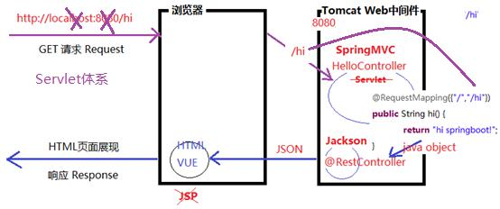
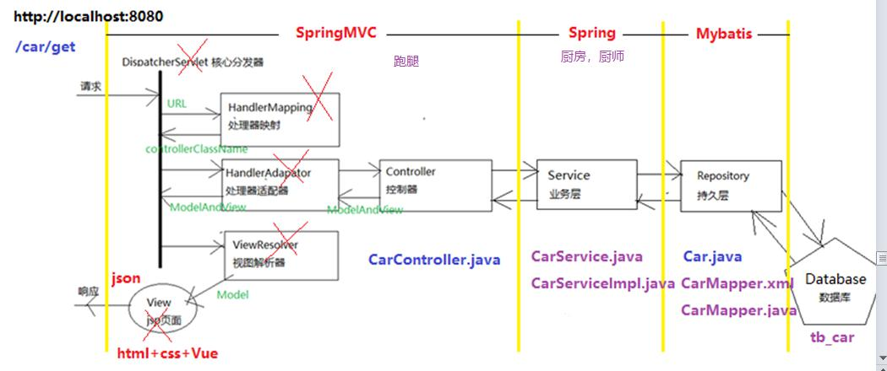

## 知识回顾
Maven项目管理
1）jar包，大型项目调用很多第三方的jar，只需要写pom.xml，它就根据写的某个依赖，它自动下载这个相关
jar包，如果这个jar（class）如它又调用其它第三方jar，也会随之下载。  
如果我们在配置maven把同时下载源码包也打勾，也会同时下载源码，翻源码  
2）怎么管理这些jar，它通过三级仓库  
中央仓库，全球唯一，maven官网，Apache组织  
镜像仓库，（私服）：git镜像，码云，每10分钟去更新一次。它开始时都是空  
本地仓库，本机，每位同学都有一个本地仓库  
这样的设计随时可以把本地仓库清空。（新机器、jar访问出错，用别人的覆盖）  
3）所有项目用的jar都放在一个本地仓库中，它们不会冲突吗？  
发明：坐标，多级目录，通过目录起到分类作用  
groupId 组Id，域名倒写 cn.tedu  
artifactId 构建Id，项目名称  
version 版本号  
名称厂商都会发布到Maven中央仓库，不允许！全球唯一  
4）maven命令，它会自动执行前面阶段命令，eclipse/idea  

### SpringBoot和Maven有什么关系？
它们目标根本就不同  
Maven项目构建工具，SpringBoot本质把开发者引入到SpringCloud微服务路上  
SpringBoot基于Maven，它也可以项目构建工具，SSM三大框架项目  
新的好处：  
1）Maven需要开发者自己去维护pom.xml，特别添加依赖，排除依赖冲突  
2）它Spring团队它实现父项目，把主流jar都加好了，我们无需自己去写，它集成好了  
3）如果项目完成好，就和Maven无关，SpringBoot全面接管项目启动和加载！  
  
404错误，网页链接没有找到，springmvc它的controller就没有找到  

### Tomcat web中间件
nodejs运行javascript容器，tomcat（免费）运行java的容器（Servlet）  
glassesfish、jboss、webspare、weblogic（牛，收费）  
分布式，集群，很多机器（几十台，几百台，几千，几万）  
微服务架构对资源（硬件、软件环境）减低  

### 底层，SSM。不影响后续开发，但如果能听懂，能掌握就更好
有利大家对底层了解。    

浏览器：http://localhost:8090/hello，怎么找到HelloController.hello方法并且调用  
HelloController hc = new HelloController(); //创建对象  
hc.hello();	//调用它的hello方法！  

在springmvc(spring)框架IoC控制反转，它来管理对象  
1）Spring它底层去创建对象  
2）它底层去调用方法  

3）怎么把http://localhost:8090/hello和hello方法对应呢？  
注解：@ReqestMapping("/hello")，规定全局唯一，它是在某个方法之上  

### 怎么使用SpringMVC



为什么需要SpringMVC，先了解三大框架各自负责内容，  
SpringMVC要完成框架任务里面有很多组件：  
1）DispatcherServlet底层java web规范Servlet。封装  
2）HandlerMapping 处理器映射，url解析  
3）HandlerAdapator 处理器适配器，找到Controller  
4）CarController 实现请求request 映射，调用它业务方法，最终响应 reponse  
5）返回ModelAndView被Model（Car），返回java对象  


### 案例：汽车信息从系统中获取
请求：http://localhost:8090/car/get  
结果：页面上展示 car里的数据json字符串  
car.java对象，利用@RestControlller把java对象转换json字符串返回  

### 思路：请求这个链接，返回json字符串，返回ajax请求，把json字符串转换js对象  
js对象利用Vue解析里面数据，最终在页面展现    


### 开发步骤：
1）创建springboot项目（maven），web，复制hello项目pom.xml    
2）CarController.java    
3）Car.java    

保时捷718 Cayman T，红色，641000元起  

### 404错误，挨个几个地方检查，通用错误
1）Controller类上面注解@RestController  
2）注意路径  
3）url浏览器输入：http://localhost:8080/car/get，跟@RequestMapping("/car/get")对应  
4）刷新项目，有环境有缓存，project/clean清除下项目缓存（bug）  
5）把老师项目创建，src下的内容覆盖+pom.xml，删除target临时目录  

### 案例：学生信息结合，html表单和后台代码结合
找到web/day03案例，  
表单中填写数据，提交到后台（springmvc）  
重点学习，springmvc如何接收到这些参数  

表单本身就可以提交信息到后台  
```<form action="url" method="get/post">  ```
标签，所有要提交的表单控件必须放在这个标签中，放在外面是不会提交  
习惯在body标签下就写form  
还要加一个提交按钮，submit，它点击完成会自动提交action指定的地址  
```
http://localhost:8090  
/stu/add  
?name=		如果没有填写就是一个空字符串，null  
&age=  
&sex=on/off  
&hobby=on/off  
&edu=6  
```

unicode编码，汉字u8进行编码 %E4  


get请求方式的特点，html规范自动把表单中的组件所有值拼接成一个字符串  
key就是组件name（早期）或者id（新），value就是你填写的值  
如果组件名称相同name,id，后台会以一个数组来接收  

### get和post请求差异：  
get是直接可以在浏览器url中看到参数，第一个参数？，后面的多个参数&  

http://localhost:8090/stu/add  
?name=chen&age=12&sex=0&hobby=%E4%B9%92%E4%B9%93%E7%90%83&hobby=%E7%88%AC%E5%B1%B1&edu=1&submit=%E4%BF%9D%E5%AD%98)

而post请求把这些参数都隐藏，你看不见！！！！会隐藏浏览器请求中，传递后台  
http://localhost:8090/stu/add  

### springmvc负责是把请求中数据传递Controller（接收这些参数）
1）接收单个参数，接收id，html隐藏框 input type="hidden"，不在页面中展示，但是会传递后台  
2）接收多个参数，接收name,age,hobby数组  
3）接收对象 Student（Model）  
4）url特殊RESTFul形式  

### 开发步骤：
1）StudentController  
	a.接收单个参数 pid  
	b.接收多个参数 name, age, hobby  
2）Studenet.java  POJO（私有属性，利用对象接收参数）  
3）RESTFul （接收少量参数）  

### 页面错误：
404  
400 类型转换错误  
@RequestParam("id") 注解要求严格，页面必须有id参数提交，没有就报类型转换错误  
日期：英文日期：2020/02/12，中文日期：2020-02-12  

### 小结：
1）SpringMVC 帮我们减少工作量，它封装很多开发细节（高级程序员、架构师），坏处不透明  
必须死记规则  
2）注解总结  
	a. @Controller ，标识这个类controller类，springmvc会增强它  
	b. @RequestMapping，请求映射，把html里的表单组件text,number,radio,checkbox提交内容，  
	把http://localhost:8090/car/get，找到对应方法，来利用反射执行这个方法，把html参数值封装到方法参数中
	c. @RequestParam("id") String pid，它把页面html中id的值，存放参数pid中，不同时才需要这个注解  
	d. @DateTimeFormat(pattern="yyyy-mm-dd") 把日期格式yyyy/mm/dd改成yyyy-mm-dd，转换，否则400错误  
	e. @SpringBootApplication 标识RunApp类是一个springboot项目，底层会做springboot引导  
3）POJO类  
	a. 所有属性私有  
	b. 一堆get/set  
	c. 为了调整 toString()  
4）前台和后台如何贯通！  
	前台：html页面+css+bootstrap，表单和后端来对应  
	后台：Java的controller来对应，pojo对象  
5）请求类型：HTTP协议的规定  
	a. GET，url后面直接显示表单值和参数 name=wang&age=18...，不安全，url长度限制：255  
	b. POST，url后面干净，没东西，安全，习惯开发就使用POST请求，url长度：8k=8*1024  
6）开发步骤：  
	a. 写pojo对象：Student.java，所有属性，产生get/set，产生toString  
	b. 写controller，StudentController，添加方法，添加RequestMapping，使用pojo对象  
	c. 复制RunApp.java  
	
### 作业：  
1、完成student项目搞定！  
2、反射代码熟练！  

