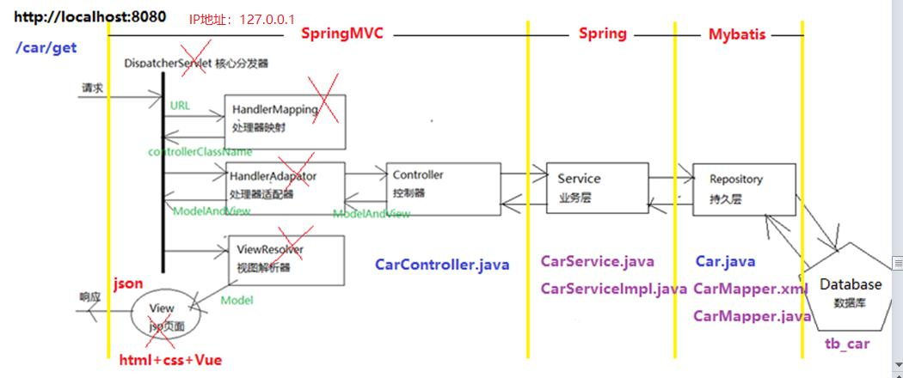

## 知识回顾
### 三大框架第一框架：SpringMVC
SpringMVC，基于Spring框架，   
MVC框架（Model、View、Controller）和前台页面交互框架 j2ee  
Struts1、Struts2(webwork) xml、SpringMVC 3.0全面推行注解方式  
性能：servlet(j2ee) > SpringMVC（DispatcherServlet） > struts1 > struts2  

### SpringMVC的作用
Servlet规范：处理http请求（web网站）  
1）处理请求：request  
	html表单提交数据，servlet规范把这些数据就存放在request对象  
	request.queryString = "?name=tony&age=18..."  
	接收到查询串，所有的参数的类型是字符串  
	String name = request.getParameter("name");  
	Integer age = (Integer)request.getParameter("age");  
	日期  
	
	SpringMVC，它内部进行转换，如果转换成功，它会自动放入变量中  
	(String name， Integer age)  
	如果转换失败，放弃，变量初始值null  
	(Student student)  
	name，判断如果是复杂Object，利用反射获取私有属性，如果发现name属性，就设置值，  
	如果没有发现name属性，放弃  
	
	a. 单个参数，日期@DateTimeFormat(pattern="yyyy-mm-dd")  
	b. 多个参数  
	c. 对象  
2）处理响应：response  
	返回，html片段，vue template  
	返回java对象给jsp页面（ModelAndView）  
	主流方式前台请求处理完成返回json（java对象序列化），和大前端Vue+NodeJS  
	方法返回java对象，@ResponseBody标识，底层把java对象进行序列化，json字符串  

### SpringMVC内部工作流程，有哪些组件（面试）



单一职责，分层，职责明晰，为大项目做，方便团队开发（前端、后端、数据库DBA）  
1）DispatcherServlet，本质封装Servlet，核心分发器，请求转发  
2）HandlerMapping， 处理器映射，解析url，/car/get，包括参数封装 name,age,hobby,Student  
3）HandlerAdapator，处理器适配器，负责找到对应Controller，CarController，底层解析  
@RequestMapping("/car/get")，找到这个所对应方法，反射  
4）执行完成Controller，把数据封装Model对象中  
5）ViewResolver，视图解析器，把model传递页面jsp，把model转成json字符串，返回页面  

### 三大框架如何学习？
如果看不懂底层源码代码同学，1、案例熟练实现（开发）、2、工作原理话术说出来（面试）  
能看懂，能大概能写同学，深挖ssm源码  

### spring框架它强大哪里呢？
j2ee，EJB 天生是远程传输，分布式结构，3.0完蛋  
EJB 2.x （weblogic），写sql查询where，为每一个条件 name=chen and age=18  
spring作者，写了一本书 spring without EJB  
spring3.x 全面引入注解开发，大大简化开发，不是你写，spring底层完成！  
口号：不重复发明轮子！		拿过来，这个东西非常强大！  
spring没有所有都自己实现，它把业界最牛的产品集成！  
旧三大框架：struts1	 +	spring + hibernate  
				 struts2  + spring + hibernate  
新三大框架：springmvc + spring + mybatis	小项目  
微服务：		dubbo 阿里	，dubbox当当		15,16	，基于ssm   
				springcloud  
					a. netflex 网飞，先开源后闭源  
					b. 自研 springcloud alibaba  
spring是真正的王者!  
 				
### spring为什么能这么强大：两大亮点 
框架是有设计思想：    
IoC 控制反转（inversion of controller)，剥夺了对象创建权  
Car car = new Car();  
car = null;  

struts2 使用对象model，car  
spring框架剥夺了java创建和管理（生命周期）对象权利  
逼迫所有其他框架都依附于spring框架  
springmvc参数封装，你不写，spring框架底层写！好用，免费，提高开发效率，减少出错  

把权利反转，本来是开发者的权利，变成框架的权利！  

IoC带来了新问题：对象依赖  

	需求：打印某个员工信息（username）所在部门（deptname），  
	产生的问题：对象是有依赖关系的，员工对象依赖部门对象  
	User user = new User();  
	Dept dept = new Dept();  
	user.setDept(dept);		//依赖关系的体现  
	打印user时，会同时把dept的打印  

DI 依赖注入：dependecy injection  
user.setDept(dept); 	自动完成这句话  
注解：@Autowired注解标识，底层会自动执行这句话  


### spring框架提供两种方式，底层去创建对象
xml方式（淘汰），注解方式
Car car = new Car();
1）告诉spring框架car对象，告诉全局限定名：cn.tedu.car.pojo.Car
spring就通过全局限定名，底层通过反射来创建对象
在xml文件中配置，bean（java中万物皆object，spring中万物皆bean）
注解方式，xml配置方式不同，包扫描！上面每个object写一句bean声明，实现一句话n个对象！

xml文件文件头，<!DOCTYPE，文件头官网提供，标识这个xml中允许有哪些元素。


### xml方式开发步骤
看spring框架怎么创建这个对象，怎么引用这个对象
1）pom.xml 含义spring框架  
2）applicationContext.xml 核心配置文件，名称写死  
3）xml文件头，直接复制，官网提供  
4）创建普通类：Hello.java  
5）xml文件中配置bean标签，  
	两个属性：id（beanName)：hello（死约定）  
				class 全局限定名：包路径.类名，反射  
6）测试类，ClassPathXmlApplicationContext(xml文件)，创建spring环境  
7）Hello hello = (Hello)ac.getBean("hello"); 会到spring环境（容器）  
8）hello.hi();		无需创建对象，就可以调用这个对象的方法  

```
<beans xmlns="http://www.springframework.org/schema/beans"
	xmlns:context="http://www.springframework.org/schema/context" xmlns:p="http://www.springframework.org/schema/p"
	xmlns:aop="http://www.springframework.org/schema/aop" xmlns:tx="http://www.springframework.org/schema/tx"
	xmlns:xsi="http://www.w3.org/2001/XMLSchema-instance"
	xsi:schemaLocation="http://www.springframework.org/schema/beans http://www.springframework.org/schema/beans/spring-beans-4.0.xsd
	http://www.springframework.org/schema/context http://www.springframework.org/schema/context/spring-context-4.0.xsd
	http://www.springframework.org/schema/aop http://www.springframework.org/schema/aop/spring-aop-4.0.xsd http://www.springframework.org/schema/tx http://www.springframework.org/schema/tx/spring-tx-4.0.xsd
	http://www.springframework.org/schema/util http://www.springframework.org/schema/util/spring-util-4.0.xsd">
```


### spring注解方式
1）需要配置文件applicationContext.xml，配置包扫描语句，指定扫描目录pojo，所有类会自动创建  
2）创建ApplicatContext对象，还是ClassPath......  
3）ac.getBean("hello")  

 No bean named 'hello' available    
 没有了bean的标签指定，pojo并不是所有的类都需要创建实例？  
 给一个标识，标识它需要创建实例，@Componet注解！spring检查pojo类，  
 如果有这个注解才创建实例，如果没有这个注解就不创建对象实例！  
 
 可以看到，注解框架一旦搭建好，只写业务代码，而无需再次配置环境！   
 注解方式优于xml配置方式！  
 
 ### spring底层实现工作原理（了解）初始化，创建对象，容器，匹配，getBean
1）包扫描（不去实现），拿到对象和包路径  
2）创建容器map（k,v）  
3）匹配，创建对象，放入容器  
4）创建getBean("hello")  

模拟ApplicationContext接口  
模拟ClassPathXmlApplicationContext（init，createObject，getBean）  

创建步骤：  
1）创建java工程    
2）创建ApplicationContext接口    
3）创建ClassPathXmlApplicationContext类    
4）构造方法（初始化init，bean定义 BeanDefined类，createObject放入容器）   
5）getBean方法    

### 因为IoC，Spring来创建对象，对象关系？DI
1）创建核心配置文件，设置包扫描（拷贝）  
2）创建pojo，dept，user，这两个对象关系，注解@Component，@Autowired  
3）写测试类，调用对象  

需求：用户的所在部门，怎么在pojo中体现这个关系？  
1）传统方式，set注入（利用set方法把关联关系绑定）java编程  
2）@Autowired 自动装配，spring自动实现  

## 小结
1）spring实现IoC控制反转，把程序创建对象控制权，抓在手里，所有人就必须依赖我  
spring提供很多方便功能，而这些功能自己可以写，代码量很多  
2）IoC控制反转具体怎么实现的？  
a.xml  
	在applicationContext.xml核心配置文件，通过<bean id="" class="">来实现  
	每个对象要写一行，xml没有编译，字母写错，位置写错，运行时报错  
	spring在启动时，找到核心配置文件，解析xml文件，dom4j。拿到所有bean标签  
	能拿到id=hello和class=cn.tedu.pojo.Hello，创建对象，反射按class进行反射  
	得到对象实例，然后把它放入容器map.put(id, instance)。怎么获取？getBean(id)  
b. annotation 注解方式  
	在applicationContext.xml核心配置文件中，通过一行代码  
	包扫描：<context:component-scan base-package="cn.tedu.pojo"  
	java提供磁盘io一套api，它获取磁盘目录，文件和子目录  
	文件名：User.class  
	路径：D:\java\ws\2012\spring-annotation-ioc-2012\src\main\  
	java\cn\tedu\pojo  
	路径+文件名：java.cn.tedu.pojo.User(className) 经过api层层转换，获取到全局限定名  
	user(beanName)  
	
	把这两个信息放入BeanDefined对象中，利用反射创建user、dept。。。  
	把它放入全局成员变量，beanDefinedList中  
	
	类的构造方法执行createObject方法  
	遍历这个list，获取每个bd（beanName,className)  
	拿到className，利用反射创建对象实例  
	
	放入容器map(key=beanName，value=instance)  
	
	getBean，从容器中获取，"hello"=key，根据key就获取对应value，获取到对象  

3）IoC和DI什么关系？  
IoC概念，编程思想（好莱坞原则）  
DI具体措施，因为spring要实现IoC，衍生bug！，副作用。来解决问题  

### Autowired自动装配，实现DI
@Autowired标识，spring通过反射拿到类，拿到类的属性getField();，拿到属性上注解  
user  
@Autowired  
private Dept dept;  

如果有这个@Autowired注解，getBean("dept")，获取到容器中dept对象  
反射set方法 set(instance, dept);  
打印user对象时，getDept就可以拿到值！  

### 作页：
1）xml实现ioc  
2）annotation实现ioc  
3）annotation实现di  
实现ssm整合时，就会用到这些知识  