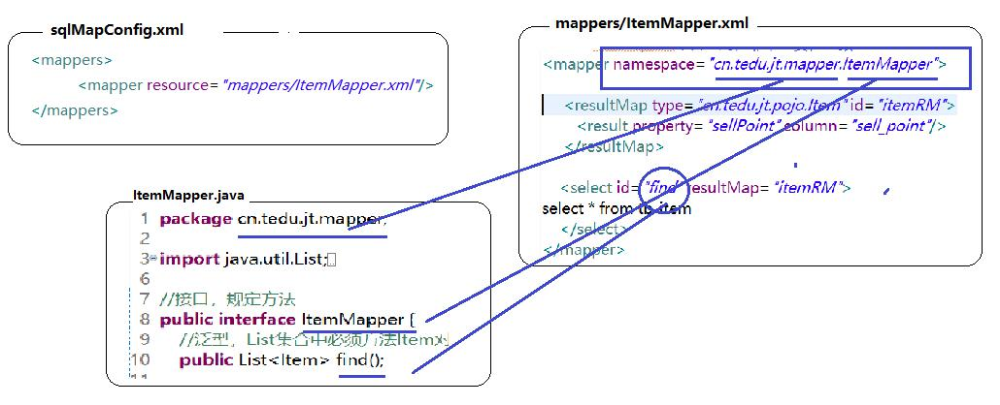

## 知识回顾
### AOP面向切面编程
j2ee，servlet标准（网络请求request和响应response），tomcat实现了这个servlet标准  
都是拦截方法执行，例如：权限判断  
a. servlet 过滤器filter，只能用于servlet，  
b. springmvc 拦截器interceptor，在controller中用  
c. spring AOP(aspectJ) ，不光b/s还支持c/s，嵌入式，它里面没有servlet/controller，方法  
结论：spring aop更加强大，它不局限在request和response的处理  

### spring AOP都有哪些东西？
@Aspect	注解，此类切面类  
@Component		告诉spring我这个类要进行管理，创建对象实例  
@PointCut	切点，谁进行拦截，谁不进行拦截。拦截器中所有的请求都拦截，可以选择要拦截和不拦截  
判断依据：切点表达式，满足或者匹配切点表达式条件true，放行；false，不处理（相当于不拦截）  
方法：修饰符、返回值、包路径、类、方法、参数  
public static void cn.tedu.car.RunApp.main(String[] args){}  
切点表达式：*代表一个通用，..代表多个通用  
public * cn.tedu.car.service..*.*(..)  
@Pointcut("execution(public * cn.tedu.car.service..*(..))")

通知：5种，前置通知pre，后置通知post，完成返回通知complete，异常通知，最强大环绕通知  
@Around（空方法）  
around方法（ProceedingJoinPoint必须是这个对象，它能获取被拦截对象，也能执行对象方法）  

在所有类上运行时，动态给类的方法添加代码  
动态改变别人类填写代码，黑客  

### 为什么要用mybatis
数据库结构化，sun jdbc规范，结果集对象ResultSet(表，字段name，类型varchar)  
java是面向对象，model对象，POJO，数据name,String  
数据库技术有自己一套法则，java语言有自己的一套法则。jdbc  
1）高并发下宕机  
2）对象model  
转换者：hibernate、ibatis，Mybatis胜出大中型项目，hibernate小型项目  
hibernate全面向对象ORM框架（HQL），mybatis半面向对象ORM框架（SQL）  

### 怎么用mybatis?
1）sqlMapConfig.xml	核心配置文件：JDBC事务，数据库4个参数  
2）Item.java POJO	代表数据model对象，暂时数据，传递数据  
3）ItemMapper.xml 核心独有，发明了一套标签，标识CRUD，查询<select>，写SQL  
4）SqlSessionFactory 线程安全，高并发情况，全局就一个，术语：单例，成员变量  
5）SqlSession 线程非安全，高并发下会出乱子，私有，为每一个用户创建一个，术语：多例，（原型），局部变量  
6）.selectList  

###解决字段和属性不对应
1）sql自身解决，字段起别名  
SELECT t.sell_point AS sellPoint,t.*  
 FROM tb_item t    
 
2）利用myatis自身特性ResultMap强大  
Result结构，Map映射，新的映射规则  
id id  
title id  
sell_point> ResultMap写一个映射规则 >sellPint  

子定义一个ResultMap，在select标签上引用这个映射规则接口 itemRM   

### mybatis提供两种方式操作
1）纯xml方式  
2）xml+接口方式（面向对象方式）  

### 只创建接口，实现类呢？怎么找到xml中select标签，怎么find的id？怎么定位的？

真正底层是创建了实现类，动态创建，你看不到，内存中  

动态代理技术动态产生类：  
jdk动态代理（$Proxyn），cglib动态代理（cgblib....）  

断点：观察变量的值，要看变量后面设置断点  

### mysql表的主键，int/long支持自增
auto_increment ，数据库会记录当前值，每次新增一条记录时，这个值+1  
不需要开发者填写  

### sql中值写死了，mybatis动态标签
配合方法把参数传入，mybatis加入  
单值：id，#{id}  
对象：item，#{id}=item.id，#{title}=item.title，#{sellPoint}=item.sellPoint  

## 小结
### mybatis 完成ORM，对数据库封装java对象
实现两种方式：  
1）xml方式，selectList,insert,update,delete,selectOne  
2）接口方式，重点  

### 接口方式开发步骤：
1）写映射xml文件，配置各个标签  
2）在接口中增加它的方法，和标签一一对应，  
public resultType/resultMap 标签id( parameterType)  
public List<Item> find(String title);  
3）session可以按接口方式调用  
ItemMapper mapper = session.getMapper(ItemMapper.class);  
mapper.find("%诺基亚%");  

### 映射文件 ItemMapepr.xml
1）namespace命名空间：它要和谁来对应？但是命名空间名字和接口类的名字相同  
2）返回值类型：  
	a. resultType：int/long/string/Item  
	b. resultMap：对应特有resultMap标签（如果有pojo的属性和结果集字段column不一致）  
		多表联查 left join, inner join, right join  
		type=返回值对象（数据放到哪个对象中）Item  
3）参数类型：  
	a. parameterType：int/long/string 单个参数，/Item 对象参数  
	b. parameterMap：废除，被parameterType替代  
	
	参数和返回值需要时声明，不需要时就不写！根据业务需求定。  
4）占位符  
	#{id}，代码安全，preparedStatement，?，防止sql注入，安全  
	${id}，代码不安全，拼串 title = 'title'  
5）自增主键：mysql直接支持，独有 auto_increment  
mysql表会记录最后一次插入值，+1。中间删除了一个id，维护成本过高，舍弃  

6）线程安全，和线程非安全  
线程安全对象：支持高并发，加锁，阻塞（等待）  
SqlSessionFactory，成员变量  

线程非安全对象：不支持高并发，不能为成员变量（多个方法共享）  
写在方法内容，局部变量，方法私有，  
SqlSession，只能放在方法内，每次都要创建  

7）单元测试 @Test  
4.x	@Before	  
5.x	@BeforeEach  
双击执行@Test，jUnit它会先执行@BeforeEach方法  
	