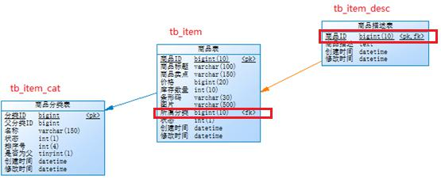

## 知识回顾
### mybatis持久层框架，完成数据库的封装，半面向对象框架
一边关注是xml中如何配置sql（面向过程编程），一边关注是java模型对象（面向对象编程）  
半ORM映射框架。  
### mybatis完成数据库表的结果集和java模型对象映射
select sell_point as sellPoint, t.* from tb_item t  
从这个语句可知，最终mybatis是从结果集中获取数据，写入对应java对象中  

1）根据jdbc提供元数据：getMeta().getColumneName()，根据列名获取某行值  
	sell_point，（123）  
2）反射，获得pojo的私有属性，  
	private String sellPoint;  
	反射 sellPoint.set()  

### mybatis 动态sql
1）占位符，#{}、${}  
select * from tb_item where title like #{title}，preparedStatement占位符 ?  
2）参数：parameterType 全都支持，  
	单值：两种方式：mybatis提供 string/int/long，类似java方式：java.lang.String  
	多种：pojo对象，复用，传递数据，参数作用  
3）返回值：resultType：string/int/long/pojo，/resultMap，表的字段和pojo名称不同时，多表联查  
4）xml标签  
	select查询（find、get、count）、insert（新增）、update（修改）、delete（删除id）  

### mybatis提供3种操作方式
1）xml方式：必须写映射文件 ItemMapper.xml，session.selectList()、selectOne()  
2）接口方式：面向对象的方式 ItemMapepr.find()，  
	它通过cn.tedu.jt.pojo.ItemMapper.find()=xml.namespace(约定)  
		=cn.tedu.jt.pojo.ItemMapepr，找到映射文件，find找到某个标签id（唯一），获取sql语句来执行  
	本质还是执行xml映射文件！  
3）接口+注解方式：把xml消灭掉（99%）多表联查resultMap，需要映射文件  

### 问题所在
查询语句，如果用户没有输入查询条件，此时这个条件应该忽略，  
删除语句，传递多个参数 in (1,2,3,4)  

动态SQL    
标签：if判断、where、set、foreach形成in子查询，id就可以多个值，批量删除  
if条件成立时，造成新的错误，sql语法的错误，多了一个and  
有两个方式来解决：  
1）sql技巧  where 1=1  
SELECT * FROM tb_item WHERE 1=1  
AND title LIKE '%诺基亚%'  
AND sell_point LIKE '%超值特价%'  

2）利用新的标签：  
if 判断作用，如果条件成立就出现拼接sql字符串中，如果条件不成立，不出现  
习惯拿null来作为判断依据，但是如果你业务上就需要用null值，就不能使用null作为判断条件
test="title != ''" 按空字符串判断
age between 10 and 20

where 自动删除条件前面的and或者or  
set update修改，如果最后一个set条件多余逗号，会自动删除    

```
foreach 标签，map(key=ids)  
collection="ids"、item="id"、open="("、close=")"、separator=","
--#{id}

in (1,2,3,4)
```

java调用时：
```
Map<String,Object> map = new HashMap<String,Object>
Long[] para = {1,2,3,4};
map.put("ids", para);
```

### 两个小的技巧
1）标签：sql + include  
	sql标签定义字符串变量  
	include标签引用  

2）pojo去掉包路径，参数，返回值，直接对象名称 cn.tedu.jt.pojo.Item简写Item  
	sqlMapConfig配置全局别名  
	所有映射文件中的包路径就可以干掉  
	只管理映射文件中配置，而不是java对象  

### ResultMap
1）如果数据库表字段（结果集）它和POJO属性名不一致，通过它来做映射  
2）多表查询（查询多个表，在内存中构建一个大大结果集）  
表关联：4种，一对一、一对多、多对一、多对多（两个一对多）  
mybatis，resultMap配置：对一 asociation，对多 collection  
约束：  
1）多表联查配置主键 id，需要映射字段result标签（sell_point），同名price可以省略不写  
2）要求：返回大大结果集中不能有同名字段，如果有多个id，取第一个，不会报错（坑）  

3张表，  
1）对多，tb_item_cat 商品分类表 和 tb_item 商品表，一对多（一个分类下有多个商品）  
2）对一，tb_item 商品表 和 tb_item_desc 商品描述表，一对一（一个商品有一个描述信息）  
  

### 实现 tb_item_cat 和 tb_item关系（对多）  
1）两张表的查询 inner join，写好SQL，构建大结果集  
```
-- 查询某个分类下是商品信息
SELECT
  c.id, c.name,
  t.id, t.title, t.price
FROM tb_item_cat c INNER JOIN tb_item t
ON c.id = t.cid
```
2）创建java工程：springboot  
3）创建ItemCat.java POJO对象  
4）在映射文件中ItemMapper.xml中添加ResultMapp映射  
5）测试  


### 小结
1）动态SQL 标签  
if 和java语言判断作用，<if test="title != null"></if>  
	条件成立true，标签中间内容就拼接到sql语句中；条件不成立false，不拼接  
	where条件，查询条件变化无穷  
	update，修改某几个字段，其它的值不修改  
	delete 按某个条件来删除  
where  
	如果前面多余一个and或者or，它会干掉，不多余，忽略  
set  
	只同于修改，干掉最后多余逗号 set title='123',  
foreach  
	用于in子查询，习惯是多个id来删除，  
	查询语句：select * from tb_item where id in (1,2,3,4);  
sql+include，在xml中定义变量，多处引用，大量重复值  

2）映射ResultMap  
a. 字段和属性不同，通过它来映射  
b. 对象关联  
	表关联：一对一，一对多，多对一，多对多（3张表，中间表）  
	对象关联：一对一，一对多，多对一，多对多（两个一对多）  
		老师和学生多对多（一个老师多个学生：一对多；一个学生可以听多个老师课：一对多）  
	mybatis映射关联：不管主体是谁，只关系和它关系，对多，对一（两种关系）  
	b1. 对多：collection + ofType  
	b2. 对一：association  

3）什么时候item(属性property，代表对象实例)，什么时候Item（类型，类，首字母大写）  
属性从pojo对象私有属性而来，对象实例名称  

4）配置对象关联都是单向关联  
单向关联：  
	ItemCat									主  
		private List<Item> items;		从  
	方向：ItemCat > Item  
双向关联：  
	ItemCat									主  
		private List<Item> items;		从  
	Item											主  
		private ItemCat itemCat;		从  
	方向：ItemCat >Item，同时，Item>ItemCat  
	
	
	