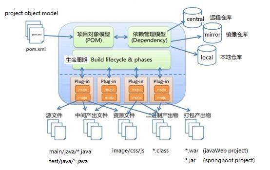
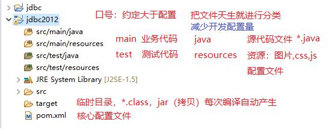
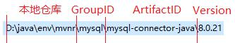
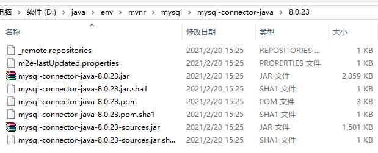

## 知识回顾
### vue+element-ui前端界面
element-ui 很多大公司采用，写法，语法
Vue 数据驱动，组件化Item.vue
1）数据驱动，体系开发者关心不在是代码api，只关心数据（业务）
2）组件化，复用，一旦创建好一个组件，这个组件就可以给其他人共享

### 自己定义一个组件 Item.vue
1）.vue文件，它有3部分组成  
a. template 模板，html+vue片段（SPA单页面开发，它只是这个页面一部分）  
b. script 脚本，形式 export default{}，本质js脚本，数据区，方法区  
c. style 样式  
只对自己组件有效！避免不同的组件冲突。  
2）注册，Vue项目（工程），所有组件都是App.vue根组件的子组件。  
import导入，注意路径，相对路径 ./当前目录、../上级目录  
3）使用 ```<Item></Item>```标签  

### 现今开发拿来主义，站在巨人肩膀上开发，好处开发效率高
组件：element-ui 完美，它形成一套完整的ui界面，比html原生美观很多

### 列表
<table><tr><td>   
至少写两行，表格头，表格行内容（单元格）  
<el-table><el-table-column>  
只写一行，代码量少，既有label表格头的信息，又有prop=title单元格信息  
表格内容是活的，设定一个数据源(js对象list（title)，json，数据库结果集)  
对listjs对象获取其属性解析过程，是有vue+element-ui底层实现  
JSON.parse(jsonstr)变成js对象  

ajax请求后台java（springmvc）把后台从数据库返回结果集封装到java对象中      
把java对象转换json字符串（jackson工具包api），返回给ajax    
ajax底层把json字符串转换js对象 scucess方法返回js对象  

拿到js对象 ，对象数组  
foreach( o in array)  
v-for( o,i in list)  

### 新增功能
1）点击新增按钮，执行toadd事件，清空this.m数据，打开对话框，设置新增标识flag    
2）点击修改按钮，底层可以通过修改按钮获取它所在td，进一步它父元素tr，获取到整个tr  
就遍历里面每个td，获取到每个td内容，拼成row对象{title:"a", sellpoint:"b"}  
JSON.parse(JSON.stringify(row)); 经过两次转换，形成new Object()，新对象，不是一个引用  
3）保存按钮，复用，新增和修改都是一个方法，习惯使用一方法  
this.list.splice(索引位置, 删除条数, 新增js对象);  
新增：0，0，m  
修改：index，1，m  
删除：index，1  
4）如何拿索引值？  
v-for="row,index in list"  

学习：两个感觉阶段  
1）手，把手练熟，一分钟120字  
2）脑  

## 后端学习 
maven+springboot+tomcat+ssm  

### Maven
项目管理工具：  
1）管理jar包  
	传统项目管理jar方法：  
	a. 复制jar（老师给qr.jar，单位老程序员，官网，版本不兼容问题）  
	b. 创建java工程，创建lib目录，把jar放入其中  
	c. build path，项目中引用这个jar  
	d. java代码中就可以使用  
	
	Maven它 来管理jar（中央仓库、镜像仓库、本地仓库）  
	Maven解决依赖版本冲突问题（半，你去解决部分问题，阿里dubbo，自己处理）、  
	SpringBoot在Maven基础上（全面解决版本冲突，99%由spring组织解决）  
	习惯：ssm xml方式，注解方式，springboot，tomcat  
	
2）依赖  
	坐标：  
3）命令  
	mvn 各阶段操作  

	  

### 管理jar包
体现：仓库、依赖、坐标  
1）从哪里找到jar？远程仓库、镜像仓库、本地仓库  
2）把它放在哪来？  
3）怎么调用？  

下载maven.jar，  
官网：http://maven.apache.org  
下载：apache-maven-3.6.3.bin.tar.gz  

winrar解压  
找个目录：d:/java/env目录下  
不要有中文，不要有空格  

安装，配置settings.xml  
${user.home}/.m2/repository 默认maven的本地仓库，下载所有jar都要放在这个目录中  
不推荐，c盘，系统盘，干掉  
推荐：修改仓库目录，不要放在c盘  

默认仓库：中央仓库（国外网站）  
镜像仓库：默认关闭，自行配置，阿里镜像仓库  

```
	<mirror>
		<id>alimaven</id>
		<name>aliyun maven</name>
		<url>http://maven.aliyun.com/nexus/content/groups/public/</url>
		<mirrorOf>central</mirrorOf>       
	</mirror>
```

### 在eclipse中配置maven
1）windows/preferences/Maven  
2） Maven 配置，a.选择源码（自动下载对应源码包，看源码就可以直接看）  
b. 选择安装路径，添加到eclipse中，打钩关联  
c. 选择settings.xml文件（修改过的）如果目录变化，就代表安装成功。  

### 怎么使用maven帮助我们管理jar包？
创建maven project 工程，  
它多一个文件，pom.xml，配置文件（纯文本）<标签>内容</标签>  
添加依赖，体系jar，（举例：jdbc驱动包）  

选择simple简单工程之后，填写坐标：  
1）Group Id		组id，域名倒写：cn.tedu  
2）Artifact Id		工程名称，jk2020（项目名称）  
3）Version			版本号，默认值  
4）Packaging		jar  
5）Scope			compile 编译（默认值）test 测试  

### maven工程目录结构
  

maven project 自身就是使用坐标来管理的  


### 测试maven项目搭建成功
1）加入jdbc的驱动包  
2）把数据库测试java文件，复制过来，测试是否成功  

写坐标是一个jar，mysql.jar为什么会出现两个呢？  
这就是maven带来好处，传统工程要一个一个加  
maven自动去找它所依赖jar（pom.xml)，它会自动下载  

使用springboot创建项目过程：  
怎么导入依赖？  
http://start.spring.io  

使用依赖后，maven自动给我们下载jar，jar怎么来的？  
1）它是你配置的maven环境，它默认到中央仓库（镜像仓库：阿里云）下载  
2）下载后保存在哪了？  



下载后就放在本地仓库目录中  
下载非常多的jar包？怎么区分它们，万一重名怎么呢？  
坐标就是区分它们，每级坐标它就是一个目录，最终jar就放在这个多级目录中  
cn.tedu 两级目录  



Maven发明仓库、依赖、坐标，目的就是来管理jar，自动管理！！！  
SpringBoot它利用官网：start.spring.io，输入关键字，加入依赖，它会自动最高版本  
一旦使用SpringBoot技术，被牵着鼻子走，2.4.3，它会把所有它做依赖的都是最新  
副作用：版本不兼容，需要小的范围修改下个别代码  

pom.xml是在保存时，进行自动下载，我配置Maven工作，它就检查语法，没错，就下载所有依赖  
更新，提升jdk 1.8  

一旦jar包在仓库中，无需再次下载！！  

### 创建第一个springboot项目
1）创建maven工程  
2）官网产生pom.xml覆盖本地pom.xml，增加web依赖（springmvc)  
3）创建HelloController.java，创建hello方法，返回字符串，两个注解修饰  
4）创建运行类：RunApp.java，两句话，一句注解，一句run方法（固定）  

我们创建的springboot项目都是springboot子项目，  
为什么需要parent父工程，它就定义好了要或者这些框架的jar包和版本  

oracle 10g它会自动启动网页服务，8080端口，端口冲突  
换端口  
在资源文件目录下，添加：application.yml 纯文本，要求很死  
server:  
  port: 8090  
  
##总结：
后台java：构建项目 maven，springboot  

### maven替代传统项目方式：
传统项目需要自己拷贝jar包，需要自己去管理jar冲突，复制项目带着jar，项目就很大占用空间。  
maven就手工维护jar，变成自动找jar，自动下载，项目中依赖这个jar，但这个文件并不在项目中  
maven解决jar冲突，变成它来自己管理，springboot，把这些冲突，它的团队都解决，parent父工程  
maven是pom.xml，我把这个文件给你，保存pom.xml它会再从外网下载  

### maven要实现上面功能，新的概念
仓库：远程仓库，镜像仓库，本地仓库  
	保存pom.xml，maven底层会检查你依赖jar是否存在，如果有就不下载，如果没有就下载  
	先本地仓库，没有，去镜像仓库，去远程仓库，一旦找到，给镜像仓房复制，然后返回，  
	本地仓库在复制一份，返回用户  
	maven发明这套体系值得学习，仓库空，从每一次调用慢慢充满了  
依赖：  
	声明jar，早期你调用的所有jar都需要声明  
	会通过jar去找它内部要调用jar（依赖）自动把这个依赖的jar也下载  
	同时，去掉版本冲突  
坐标：  
	jar很多，怎么区分这些jar，假如同名  
	坐标：groupId 组ID（域名倒写）、artifactId（项目名称）、version（最高）、scope（编译、测试、运行）默认
	形成目录：本地仓库路径/cn/tedu/hello/1.0/*.jar。解决同名问题  
命令：mvn一套命令，a,b,c，顺序，mvn c，它会自动执行前面的命令  
mvn compile  
mvn test  
mvn install  

### springboot 替代maven来项目管理
最早目的：引入微服务 springcloud  
springboot采用maven机制，完全兼容，是maven扩展！  
和maven不同在哪里呢？  
springboot自动化依赖，父工程，所以项目都是springboot子项目，继承它整理pom.xml  
把spring框架直接继承，springmvc+spring都默认在这个工程里，  
解决jar冲突，它的工程师帮我们做了整合，开发者就非常方便，主流  

### springboot 工程
1）直接创建springboot工程，idea和sts（spring eclipse)，产生一堆垃圾文件  
2）创建maven工程，官网产生pom.xml，覆盖  

springmvc 框架，死规矩，自动化  
1）HelloController.java  
	@RestController  
	@RequestMapping 映射 hello  
2）启动main函数  
	两句话  
	@SpringBootApplication  
	SpringApplication.run(RunApp.class, args);  

### 下次课
maven环境  
eclipse升级  
oracle 升级到新自己配置端口：application.yml 约定，底层springboot会自动找这个文件名，进行加载  


