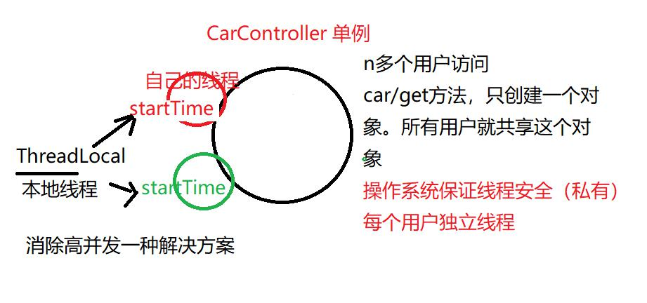

## 知识回顾
### spring框架基业长青
抓住开发核心：面向对象，谁抓住对象管理权限，它就成为核心  
IoC 控制反转概念  
1）剥夺其它框架的创建对象权利  
struts1,struts2,springmvc,hibernate,mybatis  
这些框架内部都要围绕对象model（业务数据）而进行开发  
struts1/struts2/springmvc 只负责后台系统前端（前台后台交互），它不能完成整个系统  
hibernate/mybatis 只负责持久层和数据库打交道，它也不能完成整个系统  
spring负责把大家聚拢在一起，完成整个项目，小组长，项目经理，部门经理  
spring野心，它来管理对象，可以在前台和数据库都需要对象，它可以共享给它们。  
2）spring是如何实现ioc理念？  
a. 反射，利用反射来动态创建对象，在服务开启时就创建，map，这个对象已经在内存中，直接获取，
性能要比new性能高  
b. DI对象关联？反射去实现set，自动过程，@Autowired 自动装配  
3）流行都是注解开发，更加省事，约定 cn.tedu.pojo,cn.tedu.controller,cn.tedu.service  
@Componet、@Controller、@RestController、@Service、@Repository、@Mapper  
@RequestMapping("/car/get")、@Autowired 自动装配  

### junit 单元测试
1）在要测试方法上增加注解：@Test  
2）eclipse直接支持，鼠标移动注解上，eclipse就有提示：4.x，5.x（只需导入一次）  
junit为测试而生，它有方法必须公开public，方法返回值void！  
3）如果一个类有多个@Test，它们是没有顺序  
4）如果有多个@Test，空白处右键运行，它会自动执行所有@Test方法，而且没有顺序  
要运行指定一个方法，双击方法名，然后右键运行，  
5）没门，不能几个方法执行，要么就一个，要么全都执行  

### DI核心代码
获取User对象，遍历它的所有属性  
检查每个属性的@Autowired注解，如果没有就没有di，如果有  
利用反射对属性.set，把一个对象set到这个属性中  
private Dept dept;  
dept.set(getBean("dept"))  

这里有个问题，属性是私有的！必须设置一个开关，开关默认值不允许false  
调用代码之前，把开关设置true，可以操作私有属性！  

### spring亮点技术 AOP 面向切面编程
1）面向过程 c  
2）面向对象 java  
3）面向切面  
	a. 它可以纵向编程，一下管理所有类  
	b. 可以随时加入，可随时移除  
	c. 代码没有侵入性，既完成使命，不改你类  
	d. 架构松耦合，加入和移除不会影响原来代码  

servlet，过滤器 filter  
springmvc（controller），拦截器 interceptor  
spring（controller、service），AOP面向切面编程，aspectJ （第三方）  
动态代理技术（类似反射）把动态代码加入class文件中（改内存中类）织入！  	

切面可以多个n个，每拦截一次执行时间就浪费一点，特殊业务应用时值得消耗  

### 继续加强car实现拦截器（controller）和AOP（service)
怎么实现spring的service  
增加两个类，添加@Autowired注解！  
CarController.java  
CarService.java			接口  
CarServiceImpl.java		它的实现类  

业务获得car信息  
把写在controller业务，推到service  

### 为什么要有接口
接口是一个规范，公开  
实现类隐私，一个接口有多个实现类  
jdbc，sun接口规范  
mysql驱动，oracle驱动，实现类  

面向接口编程，配置driver : com.mysql.jdbc.Driver  

### 拦截器 interceptor
作用：拦截类的方法的执行	car/get方法  
三个点的  
pre		方法执行之前  
	get  
post		方法执行之后  
complete	方法返回页面之前  

具体实现，分为两步：  
1）写拦截器 CarInterceptor/UserInterceptor，实现接口 HandlerInterceptor  
2）告诉spring框架这个拦截器类，注册，实现接口 WebMvcConfigurer  

### 监控每个方法执行时间
TimeInterceptor
1）在方法执行前 pre，记录下当前时间 startTime ，System.currentTime 毫秒值  
2）在方法执行后 post，记录下当前时间 endTime   
3）执行时间 = endTime-startTime    

### Component 注解
它标识后，spring底层使用包扫描机制，会自动创建类实例，放在容器中  
@Component 	不确定这个类分层职责  
@Controller	它是一个springmvc的controller  
@Service		它是一个spring的service  
@Mapper		它是一个mybatis的mapper  

不配置核心配置文件包扫描，它怎么还能执行呢？  
base-package="cn.tedu.pojo"  

SpringBoot项目默认采用自动使用包扫描（注解）  
基准路径：RunApp启动时目录，  
约定：controller/service所有的都是在这个目录之下  

### 为什么要用ThreadLocal对象
高并发下共享变量安全访问的解决方案

## 小结
1）spring框架，是所有框架中最强大，  
它管理对象声明周期，其他框架需要这个信息，只能从它来获取  
不得不依赖它，  
2）IoC和DI、拦截器、AOP，它就能增强我们的项目  
a. IoC 控制反转，创建对象（启动）注解@Component，  
放入容器，创建一次，供多次调用  
b. DI 依赖注入，@Autowired体现，绑定对象关系，对象实例注入  
c. 拦截器，面向切面编程  
	面向对象：横向编程，每个类CarController，CarService。关心的是每个类  
	面向切面：纵向编程，n多类，每个类所有方法的执行时间！  
	先有面向对象，面向切面是面向对象有益补充，有了更好，没有也没关系。  
	拦截器：打印日志，时间耗时统计，权限验证  
3）拦截器具体怎么实现？  
	a. 写自己拦截器  
		1- pre方法，在业务方法执行前执行  
		2- post方法，在业务方法执行后执行  
		3- complete 完成方法，在业务方法执行完成，返回页面之前执行  
	b. 注册这个拦截器  
		@Configuration spring底层会全局配置  

	如果多个拦截器，形成一个拦截器，执行顺序，先进后出   
4）方法的耗时拦截器实现  
	优化一下整个项目，性能！  
	先要找出慢地方？找到系统中慢地方，看合理不，有优化余地，优化系统快！  

	

	
	

