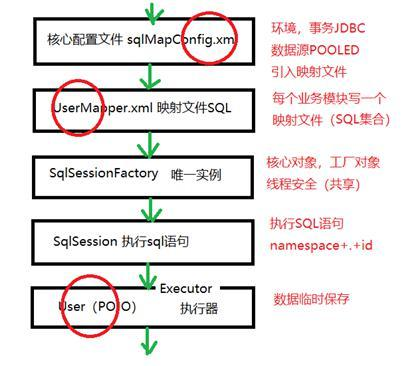

## 知识回顾
### 1）DI由于spring实现IoC，改变对象为开发者创建实例，为spring框架去创建对象  
随着对象关联关系也变成从开发者主动set注入方式改变di自动装配@Autowired  
2）底层实现思路，利用设置关联对象属性上面加一个@Autowired  
spring进行包扫描创建完成所有类对象实例，放入beans容器中  
再次扫描，获取每个类的所有属性，判断属性是否有@Autowired  
User  
	@Autowired  
	private Dept dept;  
	private String userName;  
dept属性加了注解，而userName是没有加  
这个注解就成了是否DI的判断依据，dept进行DI，userName不进行  
dept.getName()，去容器中进行Dept dept = getBean("dept")  
反射 field.set( getBean("user"), dept)  
这个过程非常繁琐，这是spring框架底层去实现，无需开发者写代码，  
开发量急剧降低，深受开发者喜爱，主流开发方式提倡注解开发。  

企业中程序员，关注点，在于怎么用好框架快速开发，快速迭代，快速交付  

### 2）拦截器，AOP，面向切面编程  
面向过程，关注点：写代码开发步骤，函数（怎么查询某个学生）  
面向对象，关注点：类（学生类）、对象（实例），怎么查询  
CarController，CarServiceImpl，UserController  
如果每个类中有相同功能：打印日志，执行方法耗时，权限  
面向切面，一次通用结构，新加的内容无需额外编码（复用）  
它可以随时干掉（系统测试阶段，试运行阶段：打印日志，执行方法耗时）  
一旦系统稳定，这些功能就关闭  

servlet规范：filter过滤器  
springmvc规范：interceptor拦截器  
spring规范：AOP  
### 3）开发拦截器需要步骤：  
a.写拦截器类TimeInterceptor  
b.注册拦截器 @Configuration  
spring框架在方法执行前去调用对应拦截器  
post有handler参数，它代表被拦截对象，  
handlert="cn.tedu.car.CarController#get"  
### 4）所有遇到注解，用在哪里  
a. @SpringBootApplication springboot引导项目启动  
以前javaWeb项目手动启动tomcat，而且要配置它，项目war  
tomcat集成在里面，直接运行springboot.main就可以，  
获取这个类上面注解@SpringBootApplication，然后启动spring，初始化类  
把所有@Component、@Controller、@RestController、@Service、  
创建对象实例，把它放入容器，获取对象快！  

b. @Controller和@RestController有什么区别？  
后者多一个注解标识：@ResponseBody 响应，  
jackson技术api工具包，把java对象转换json字符串，反着来  

c. @Autowired 实现DI依赖注入，自动装配  

d. @RequestMapping("/car/get")  
springmvc中提供，和浏览器上输入url进行匹配  
http://localhost:8090/car/get  
ip地址找到服务器	:8090/car/get  
端口号固定某个服务：tomcat是servlet规范运行环境：web中间件  
						/car/get  
把这个值传给我们的程序：springmvc，DispatcherServlet   
DS去找匹配Controller（user/dept/car）  
某个controller的方法上写注解  
@RequestMapping("/car/get") 唯一值、  
spring框架在初始化时，它初始化完毕，springmvc初始化  
包扫描，扫描所有controller类，然后获取所有方法，拿到方法上的注解  
获取这个注解value属性，都存在一个集合中  
Map.key="/car/get"，value=class CarController#get  
反射ass来创建实例，invoke回调get方法  
@RequestMapping({"/","/car/get"})  
@RequestMapping(value="/car/get")  
@RequestMapping("/car/get")  

e. @Service 约定它是描述service层  
spring包扫描，创建对象实例，把它放入容器  

f. @Override 继承，子类的方法和父类同名，给开发者看到  

h. @Configuration spring框架全局配置，全局变量，系统各处进行调用  

### ThreaLocal对象用完要自己释放，remove()，防止内存泄漏！  

## 今日内容
### aop体现拦截器思想
概念：
通知：advice 五种：
1）前置通知，pre
2）后置通知，post
3）环绕通知，拦截器没有，pre+业务+post
4）完成业务之后返回前 afterReturn，afterComplete
5）异常通知，拦截器没有，error,exception
aspectJ，比interceptor更加强大
aspectJ可以应用在各个类中！所有系统运行类都可以拦截！
interceptor只局限在springmvc
filter只局限在servlet、
spring框架就集成aspectJ，不局限在b/s，还可以扩展c/s，甚至嵌入式

必会技术，项目中就一个地方用！

### spring AOP怎么实现，开发步骤
1）导包，springboot只集成web（spring+springmvc），需要自己手动添加依赖  
官网上没有，自己添加依赖 
2）创建切面类 TimeAspect.java，@Compoment、@Aspect  
3）创建一个空方法，@PointCut(切点表达式) 切点 
	private void aopPointCut(){}  
4）最常用，功能最强大切点表达式："execution( public * cn.tedu.car.service..*(..))"  
public cn.tedu.service..CarServiceImpl get(){}  
public *  
*代表一个值，..代表多个值  
第一个*，代表返回值类型，通用，类似java的Object  
.. 代表就是多级目录，包路径  
()代表参数，(..)代表参数可以多个  

private Car set(){};	不拦截，private  
public Car cn.tedu.car.service.CarServiceImpl get(){}	 拦截  
public Object cn......	拦截  
public Car cn.tedu.car.controller.CarController get(){}	不拦截  

切点表达式，判断依据，判断规则是比较灵活，项目就配置一次  
5）环绕通知 @Around("aopPointCut()")  
6）JoinPoint连接点：切面切是哪个类，这些信息就藏着joinPoint类中  
ProcedingJoinPoint实现类，获取类名和方法名  
 
 三大框架mybatis
 hibernate
 J2EE，EJB框架，hibernate负责java和数据库之间转换
 ORM，object relation mapping，把数据库jdbc，ResultSet结果集，它不是java中model对象
 model（pojo）属性，代表数据
 ResultSet（rs.getString("name")； hibernate/mybatis name:"tony"
 
 hibernate完全面向对象，HQL，对象方式来查询数据，内部最终会转换SQL，利用jdbc操作数据
 SQL: select * from tb_item
 HQL: from Item
 
 ibatis，mybatis 投身google，半面向对象，直接拼接SQL（一套规则），直接操作jdbc
 
 软件行业发展，系统越做越大，性能考量越来越重要！mybatis性能高！
 hibernate 对象状态，OGNL表达式，非常难控制，黑客就利用漏洞百出，
 业界规划：小型项目使用hibernate，大型项目使用mybatis
 
 mybatis怎么完成orm映射，它一套规则
 jdbc：
 String sql = "select * from tb_item";
 preparedStatement对象，CRUD方法，executeQuery(sql)
 查询：ResultSet对象
 mybatis:
 把所有写sql的地方放入xml文件中，ItemMapper.xml
 Item.java POJO
 
 <select id="find" resultType="List<cn.tedu.jt.Item>">
 	select * from tb_item
 </select>
 按mybatis规则写完后，它底层自动将sql查询完成结果集，自动保存对象中
 返回是一个集合，只声明集合元素类型，默认List集合
 
 mybatis 结构
 
 
 开发的步骤：
 1）数据库 jtdb-small.sql（res库/sql/）
 2）pojo对象 Item.java
 3）映射文件 ItemMapper.xml（文件头）namespace
 4）核心配置文件 sqlMapConfig.xml
 测试类
 读取配置文件：Resourses ibatis提供，返回InputStream
 SqlSessionFactory factory = 读取sqlMapConfig.xml，builder创建工厂对象
 SqlSession执行sql
 statement = namespace.id（find）
 按规则写完，mybatis会把这些按约定规则串接，底层执行xml里sql最终映射到java对象
 返回值java对象（model）
 
 创建项目：springboot官网产生pom.xml
 新增依赖：mybatis/web/mysql驱动
 
 创建上面的两个配置文件，如果没有提示，配置一下DTD文件
 DTD文件描述xml由哪些标签组成，它会和eclipse配置形成提示
 1）sqlMapConfig.xml (配置后不生效 eclipse)
 2) ItemMapper.xml
 
 最爱犯错：
 Mapped Statements collection does not contain value for cn.tedu.jt.mapper.ItemMapper.find
 1）命名空间和statement参数写的一致不一致
 2）sqlMapConfig.xml中忘了导入xml文件
 3）调用statement别写错了