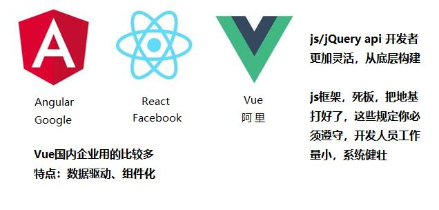
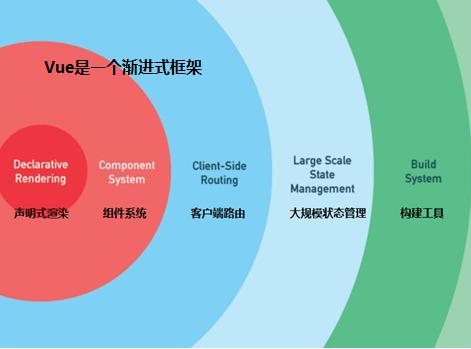
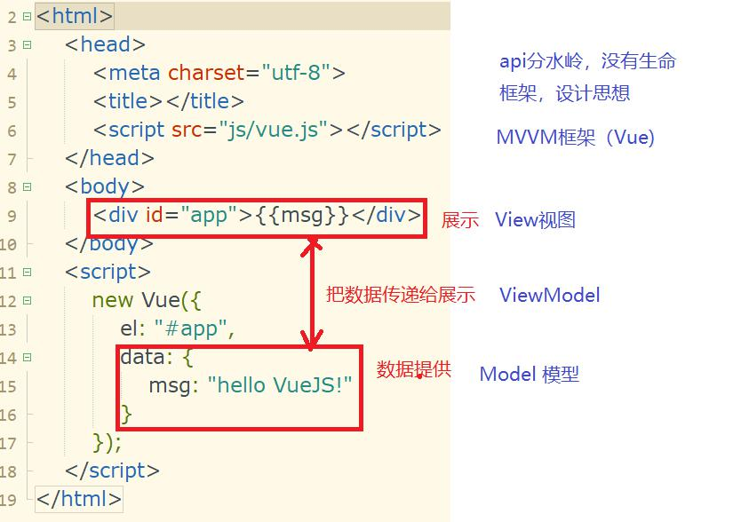
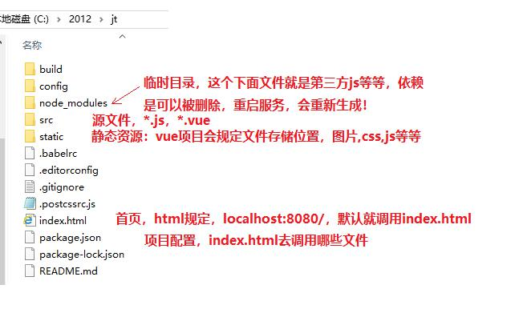

### 实现HBuilderX创建vue文件模板
1、创建html文件，  
2、选择上面：自定义模板  
3、打开目录中创建vue.txt，粘贴代码到里面  
4、创建html文件，选择模板即可  

### 页面出错了，怎么调试，怎么快速定位错误地方呢？
1、F12 进入浏览器调试窗口，能看到js、vue错误信息  
错误信息中会显示第几行错误，检查这行代码  
2、把老师代码复盖，如果老师正确，说明写的代码错误，不正确，环境问题  
3、没有现成代码可以覆盖，可以进行二分法处理，缩小错误范围，最终就找到问题  

### git clone 克隆
克隆是把远程仓库复制本地，创建本地仓库  
1）克隆别人的仓库，看其代码（本地），在实际开发中就克隆项目组，克隆自己有一份  
2）本地备份 res资源库（几个超级文档，ssm三大框架）  

执行git命令  
1）找个本地目录，存放  
2）it bash执行  
3）git clone 仓库地址  
git clone https://gitee.com/nutony/res.git  


### 安装nodejs
22-05-node-v8.11.3-x64.msi  

### 网页小技巧
写过JSP页面，java代码和html交融，混杂一起，怎么把java代码转换html一些内容
技术JSTL TAG库，起到翻译作用。
Vue怎么把vue数据翻译成html代码，Vue通过指令：v-Xxx
v-model，v-on:click（@click)

###v-cloak
它有很特殊效果，屏蔽页面晃动
看效果：F12->Network->Online换成Slow 3g 模拟网页请求速度慢
插值表达式少的时候不明显，多了页面就明显有晃动！
原因：先加载页面，后加载Vue对象，Vue才开始解析，最终替换页面插值表达式（渲染）
解决：加一个样式，把页面值div id=app整个div隐藏起来：display:none; 等Vue加载完毕，在把它展示！
```
		<style>
			/* 这个指令页面选择器，有这个属性就执行这个样式 */
			[v-cloak]{
				display: none;  //隐藏
			}
		</style>
		
		<div id="app" v-cloak>
```

### v-指令
需求：是否成年 age：  
data数据中age
指令在标签中属性方式来实现

v-show 不管条件是否成立，数据都在页面上，只是false，被样式隐藏了
v-if是真的不存在
vue非常细致，v-show如果判断非常频繁性能高于v-if

v-if/v-else-if/v-else，分支结构，只会走一个分支
需求：阶层划分，在北京要多少钱才能生活（小康）  
1）普通家庭，年10w   
2）中产阶级，年500w  
3）富豪阶级，年500w以上  

v-for、循环  

v-on、事件  

v-bind、特殊属性值  url

v-text、v-html 
指令是没有晃动，指令配合页面标签

###    vue项目
vue是渐进式框架，   
1）只引入vue.js文件  
2）升级vue.js+vue项目！（要加载一堆东西，依赖包，插件，直接拿别人现成的产品来用）  
怎么把这些第三方的插件组织起来呢？规范，nodejs+npm+webpack 打包工具  
项目有很复杂结构，而且有很多约束，你不用做，把其他工具插件组织一起，必须遵守！  

步骤：  
1）安装环境：nodejs  
nodejs是一个web中间件，翻译解析开发者写的服务端代码 javascript/jQuery/Vue  
小项目  
容器（锅）  
tomcat是一个web中间件，容器解析java的，springmvc+spring+mybatis  
大项目  
2）nodejs基于谷歌chrome浏览器内核（解析js，全球解析js最快服务）  
要引入其他js库，npm帮我们管理第三方js库(jQuery、Vue、Element-ui)  
webpack，小项目发布拷贝，大项目（配置很多环境）zip/rar压缩、一键搞定  
nodejs(node)+npm+webpack 实现大型项目的管理，像java发起挑战（大前端） 

### 安装vue项目环境：按照超级文档步骤：
1）验证nodejs是否安装好： node -v  
2）npm到国外中央仓库，换镜像：阿里淘宝  
nodejs中含有npm  
npm config set registry https://registry.npm.taobao.org  
3）安装vue脚手架（地基）  
npm install vue-cli -g  
install安装，vue-cli(vue-client缩写，vue客户端，vue.js)，-g全局安装  
验证：vue -V/ vue --version  

如果命令出错Err，不是警告warn，重新执行命令（网络不稳定）  
如果报权限不足，安装nodejs时要以管理员账号来安装  

### 安装vue项目
1）找一个目录   
vue init webpack jt  
会创建jt的项目，会有很多文件不仅vue.js    
选项记不住：参考超级文档10.10.2，一个yes，3个no  

安装成功后启动服务  
cd jt  
npm run dev，进入jt目录中  

成功了，提示下面话    
Your application is running here: http://localhost:8080  
默认端口8080，如果这个端口被占用，它会自动改端口：8081  

界面如果显示大大v图片，就代表安装配置成功！  

卡死状态（时间太长）ctrl+c中断，重新执行


### Vue项目结构


### 把jt项目导入HBuilderX
项目管理树空白地方，右键选择“导入”，“从本地目录导入”，
选择你的jt目录

package.json 只看，不要动，全局配置  
webpack.dev.conf.js 全局配置文件  

index.html 首页，定义div id="app"
src/main.js，创建Vue对象，Vue项目和Vue.js使用方式不同
```
new Vue({
  el: '#app',		挂载点
  router,			路由
  components: { App },		组件（省略后缀）App.vue
  template: '<App/>'		模板
})
```
src/App.vue 
.vue文件有三个结构，只不过内容不同
```
<template>标签中的内容html+vue代码（动态）</template> 动态网站，视图部分
<script>通过vue，js来操作页面数据，代码写在，数据部分
<style>组件的独立修饰，私有修饰，它不会影响其他组件！！！！
```
默认集成子组件，自己写的所有组件都在App.vue中包含
创建默认脚手架，创建子组件HelloWorld，默认界面下的链接就是这个组件中定义


## 小结：

### Vue
本质是就是封装js，jQuery，在代码中已经看不见了  
坏处：不知道底层在干嘛？不够透，在大型项目中，不可能所有细节都自己做，提倡“拿来主义”  
ssm，都是拿来别人的东西spring拿mybatis，springcloud微服务，网飞，阿里  
好处：Vue数据驱动，屏蔽底层js的api，无需去记忆这些晦涩难懂难记东西，只需要操纵数据！  
减轻开发者工作量，为做大型项目  

### Vue和js、jquery细节差异
获取页面上输入框   
```<input type="text" id="address" v-model="address"/>  ```
js.api	documet.getElementById("address").value = "123";  
jQuery.api 	$("#address").val("123"); 标新立异，创造新的东西，额外记忆    
vm.data.address  
address= "123";  

### Vue中有什么东西？
1）结构：死的结构  
	View 视图，页面展示内容：a. 插值表达式{{msg}}、b. 标签上加指令 <p v-for=""></p>  
	Model 模型，数据  
	ViewModel 视图模型，把视图和数据绑定起来，Vue对象，内部完成解析过程  
	衍生出：MVVM框架  
2）  
	View， 规定页面body中加div，默认修饰app，习惯，Vue对其进行解析，动态网站  
	Model，数据来源：el（element）挂载点、data数据、methods函数  
	
### Vue 提供很多指令，形成动态网站
v-model 双向绑定  
v-show、v-if、v-else-if、v-else，判断语句  
v-for，循环语句  
v-on，@click，单击事件  
v-bind，:href="url"，url不是字符串，而是数据的变量名称  
v-text、v-html，text纯文本，里面有html标签不解析，html会解析标签  

### Vue是渐进框架
1）简单的vue，直接引入vue.js  
2）大型项目vue项目，  
a. nodejs(web中间件，启动服务)/  
b. npm 依赖js插件  
c. webpack打包，编译过程（保存、重新启动）压缩  
d. vue-cli 脚手架  

## 任务：  
1、搭建环境  
2、修改HelloWorld.vue，页面展现”京淘电商平台“，改成红色  

